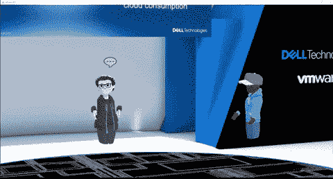
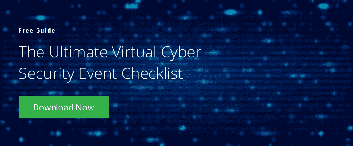

# 参加元宇宙的虚拟网络安全活动

> 原文：<https://www.mitnicksecurity.com/blog/entering-the-metaverse-for-your-virtual-cyber-security-events>

[虚拟活动](https://www.mitnicksecurity.com/blog/benefits-virtual-cybersecurity-events-over-in-person-events)可以利用虚拟现实(VR)和元宇宙，这样您就可以举办一场难忘的活动，还可以在所有网络安全方面培训您的参与者。

在这里，我们将展示元宇宙在网络安全事件中的未来应用、虚拟现实的优势以及为您的组织举办网络安全虚拟事件的主要考虑因素。

## 虚拟事件的下一阶段:元宇宙

正如 [MeetingPlay + Aventri](https://www.aventri.com/blog/metaverse-and-the-events-industry) 所解释的，元宇宙是“一个持久的沉浸式 3D 环境，它广泛使用了虚拟和增强现实等新兴技术。”尽管沉浸式 3D 游戏可能是使用元宇宙最广为人知的例子，但混合使用这种虚拟空间正变得越来越流行。

例如,《Metapolis》中的 [Meta Festival](https://www.meta-festival.com/) 是一个跨越全球的虚拟现实节日，有许多主题的每个时区特有的特色内容，都可以通过 VR 头戴设备观看。

考虑到越来越受欢迎，企业很可能会继续在虚拟活动中增加对元宇宙的使用。事实上，比尔·盖茨在他的个人博客中说，“在未来的两三年内，我预测大多数虚拟会议将从 2D 相机图像网格转移到元宇宙，一个有数字化身的 3D 空间。”

## 虚拟网络安全事件的好处

举办虚拟现实活动的好处是让观众充分参与网络安全，这个话题最初可能不会让许多员工感到兴奋。这为您提供了更好的投资回报(ROI ),因为积极参与的参与者更有可能积极应用他们所学的知识。

虚拟现实事件提供了超现实的环境和与其他化身和物品互动的能力。虚拟网络安全事件可以包括激动人心的活动，例如:

*   寻宝游戏。
*   虚拟“房间”,让数百名观众感觉像是在小范围内近距离观看网络安全演讲者。
*   与虚拟角色的互动问答会议。

除了提供来自世界任何地方的活动参与，虚拟活动比标准的网络安全活动提供了更好的受众洞察力。例如，根据您的虚拟现实活动平台，您可能能够看到观众最感兴趣的活动以及观众成员之间的参与度。

## 举办虚拟现实网络安全活动

举办一次成功的虚拟现实活动需要一些战略规划，以确保活动顺利进行，并让您的组织在虚拟环境中充分受益于网络安全意识培训。在开始规划之前，请注意以下几点:

### 把…编入预算

举办所有游客都可以参加的虚拟现实活动可能需要额外的预算。向您的观众成员提供 VR 头戴设备可以轻松确保全面参与，但重要的是要确保您的网络安全虚拟活动可以传输到所有常规设备，以防任何与会者遇到技术问题或无法获得 VR 头戴设备。

确保你选择了你能为你的与会者提供什么，不能提供什么，并将其纳入你的预算。另一个考虑是利用一个代理机构来主办你的活动，以及聘请主要发言人。请记住，“一分钱一分货”也适用于虚拟活动。

### 网络安全主题演讲人和机构

在查看任何活动的投资回报率时，拥有一位受人尊敬的、[经验丰富的演讲者](https://www.mitnicksecurity.com/hire-kevin-mitnick-to-speak-mitnick-security)会产生重大影响。然而，当涉及到为虚拟活动(如虚拟现实)实施更新的技术时，最好与具有虚拟和虚拟现实活动经验的网络安全演讲者合作。这将确保您的活动充分利用元宇宙的潜力。

为了[协调必要的技术](https://www.mitnicksecurity.com/blog/the-tech-kevin-mitnick-uses-for-virtual-events-webinars)、你的虚拟活动发言人和你的活动参与者，考虑与虚拟活动代理合作，帮助你成功举办活动。

## 凯文·米特尼克利用技术来吸引观众

在最近由戴尔技术公司主办的虚拟网络安全活动中，凯文·米特尼克使用虚拟形象通过元宇宙向戴尔员工讲述了网络安全趋势。

虽然有数百名虚拟角色观众在场，但小房间和舞台的多个实例被用来使体验感觉很有个性。互动带来了更具吸引力和沉浸感的活动，使其成为迄今为止举办的最好的网络安全活动之一。

## 举办一场完美的网络安全虚拟活动

举办一场精心策划的全公司范围的活动可以激励您的员工更深入地了解网络安全，并让他们为网络罪犯可能对您的企业构成的任何威胁做好准备。

当你包括元宇宙，这种动机可以成倍增加，创造一个更安全的员工环境。这就是为什么提前计划并考虑举办最佳虚拟网络安全活动的方式至关重要。

立即下载免费的[虚拟事件终极指南电子书](https://www.mitnicksecurity.com/lp-ultimate-virtual-cyber-security-event-checklist)，让您的下一个虚拟网络安全事件成为值得纪念的事件。

