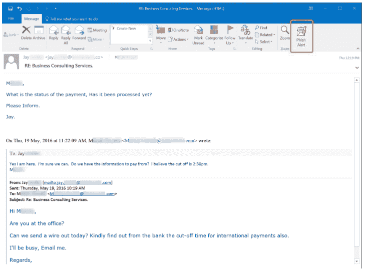
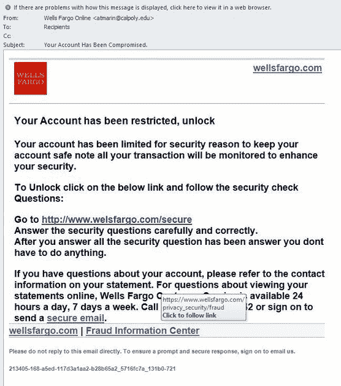

# 4 社会工程攻击实例(附图片！)

> 原文：<https://www.mitnicksecurity.com/blog/4-social-engineering-attack-examples>

我们不断告诉我们的员工要当心 [社会工程攻击](https://www.mitnicksecurity.com/social-engineering-strength-testing) ，但是尽管我们可以整天分享定义，人类通常通过实例学习得最好。

通过看到真实的网络钓鱼电子邮件，听到巧妙借口的故事，观看现场黑客演示，我们可以让我们的团队更进一步，真正理解“社会工程”这个大术语

以下是一些具体的例子，展示了流行的社会工程计划的真实面貌:

## 1.鱼叉式网络钓鱼邮件、电话或短信

网络钓鱼是一个术语，用来描述从不知情的用户那里“钓鱼”信息的网络罪犯。一些黑客发送大量信息，撒开大网，希望欺骗大量的接收者。然而，这些普通的消息通常很容易被识别为骗局。

为了编织一个更有说服力的故事，大多数精通网络犯罪的人都会研究并获得关于他们目标的深刻知识——一次一个“网络钓鱼者”。就像鱼叉钓鱼者刺向一条鱼一样， [鱼叉钓鱼者](https://www.mitnicksecurity.com/blog/spear-phishing-targeted-email-scams-what-you-need-to-know-about-this-hacking-technique) 通常每次攻击只引诱一个特定的人。

鱼叉式网络钓鱼有多种类型，它们在命名上都略有不同，但最常见的三种是电子邮件、电话和短信。

***趣闻:*** *网络钓鱼很可能是从“phreaking”一词演变而来，这个词在黑客社区中常用来描述研究电话等电信系统的人，并在他们身上编织聪明的社会工程借口。它使用“phreaking”中的“ph”来代替“fishing”这个词。*

### 网络钓鱼邮件

这些是恶意发送的电子邮件，包含将恶意软件下载到您的设备上的链接或附件。我们都收到过诈骗邮件，但有些却不容易发现！社会工程师可以伪造电子邮件地址，使其看起来像是来自老板或可靠来源的消息。

 **现实生活中的例子:**
在上面来自 [KnowBe4](https://www.knowbe4.com/spear-phishing/) 的钓鱼邮件例子中，你可以看到这些社交工程师是如何要求特定的订单号或付款转账，挖掘重要信息来对你不利的。

### 语音网络钓鱼

网络钓鱼是“语音”和“网络钓鱼”的结合这是手机版的电子邮件钓鱼，坏人打电话而不是发邮件来窃取机密信息。这些电话通常 [利用恐惧和急迫](https://www.mitnicksecurity.com/blog/the-most-popular-cyber-attack-social-engineering) 来获得快速、冲动的回电。

这些社会工程师经常模仿你从未真正交谈过或见过的有名无实的领导人，以确保你听不出他们的声音！

[https://player.vimeo.com/video/340994716?app_id=122963](https://player.vimeo.com/video/340994716?app_id=122963)

现实生活中的例子:
你收到一条语音邮件，说你的汽车保险即将到期！你必须马上回电*更新你的保险，否则你会被处罚。事实上，这并不是你真正的汽车保险提供商——这是一个骗子试图在一个虚假的续保电话中获取你的信用卡信息。*

 *### 短信网络钓鱼(垃圾短信)

坏演员不只是留下欺骗性的语音邮件；他们现在也懂发短信了！无论是工作电话还是您的个人设备，他们都在向网络钓鱼者发送有针对性的短信。

现实生活中的例子:
这些狡猾的网络钓鱼文本有多种形式。从模仿谷歌验证你的设备的虚假号码(图片 [from KnowBe4](https://blog.knowbe4.com/smishing-101-and-defenses) )到你的“电话提供商”告诉你，你在一个链接的支付门户网站上延迟付款以避免滞纳金，(黑客在其中捕获你的登录信息或银行信息)，网络犯罪分子有几种方法来锁定你的手机。

*马上警惕与* [*【新冠肺炎】相关的钓鱼邮件、来电和短信*](https://www.mitnicksecurity.com/blog/2-ways-hackers-may-trick-you-using-covid-19-phishing-schemes) *。坏演员无耻地利用对病毒的恐惧发送感染链接，伪装成疫苗注册，刺激支票存款等！*

## 2.下料

为了抓鱼，渔夫在放线之前会在鱼钩上挂一些诱饵。坏演员在留言里就是这么干的！他们在你面前晃来晃去一些诱人的诱饵——通常以优惠券、金钱、特别奖品等形式。

现实生活中的例子:
留意那些“恭喜你，你赢得了一张礼品卡！”骗局，就像我们分享的来自 KnowBe4 的截图 [。这些也可能是看起来像年终奖金的电子邮件，来自老板的伪造地址，甚至是一条消息，说你在工作中收到一个包裹的跟踪信息(当你不期望那天有快递的时候！).](https://blog.knowbe4.com/smishing-101-and-defenses)

***你知道吗？*** *当一个糟糕的演员用真实的事实编织一个虚假的故事或情景来建立信任和可信度时，这被称为“T5”。他们正在创造一个虚假的故事或借口来让你采取行动。*

## 3.交换条件

在诱饵攻击中，社会工程师通常提供诱人的交易或产品，而交换通常涉及提供*服务*以换取某些东西。毕竟，它被命名为*交换物*，因为这个短语在拉丁语中是“某物换某物”的意思

**现实生活中的例子:**
通常一个社会工程师会伪装成 IT 部门的人，打电话给一个有虚假问题的用户(例如，我们有一个社会工程骗局正在流传，并要求用户重置他们的密码)。坏演员提供了一个临时的解决方案(重置您的凭证并暂时设置一个类似“1234”的临时密码，然后进去并在以后重置为您想要的密码)。有了这个人的用户名和新的临时密码，工程师就可以进入帐户，并将其重置为只有他们自己知道的密码，并且在通话后几秒钟内就可以完全访问他们的帐户。

## 4.尾随或捎带

当你在路上，另一辆车紧跟在你后面，你称之为尾随。社会工程师使用同样的原理。他们紧跟在进入大楼的员工后面，以获得进入权——通常，特别是进入受限制的、fob/代码可进入的区域。

[https://www.youtube.com/embed/Mk9CA8MkUXY](https://www.youtube.com/embed/Mk9CA8MkUXY)

**现实生活中的例子:**一个糟糕的演员可能会装扮成一个送货员，摆弄许多包裹，或者戴着一个假徽章，穿着花哨的西装，看起来很重要。在嵌入的视频中，你会看到他们也可以使用其他社会工程黑客技术，如隐藏一个克隆你的密钥卡访问号码的设备，以进入公司办公室或大楼。

*通过阅读一些最大的社会工程攻击，看看坏演员实际上在做什么:* [*过去十年中最著名的 5 次 SE 攻击*](https://www.mitnicksecurity.com/blog/the-top-5-most-famous-social-engineering-attacks-of-the-last-decade) *和* [*历史上最大的社会工程攻击*](https://www.mitnicksecurity.com/the-history-of-social-engineering#chapter-6) *。*

## 超越社会工程攻击

[社会工程](https://www.mitnicksecurity.com/social-engineering-strength-testing) 是用来危害企业的两种顶级技术之一，但这些攻击并不是唯一的网络威胁。

这里有 5 种真正有效的方法可以提高你的数字安全 让你开始。

*