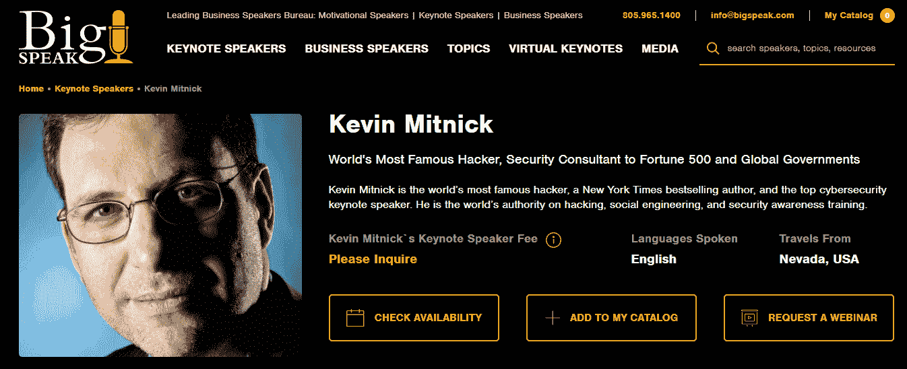
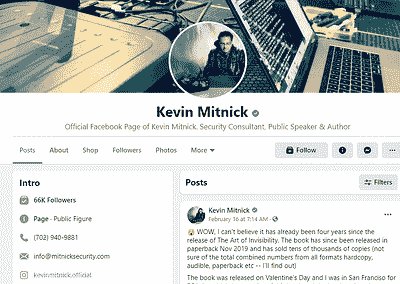
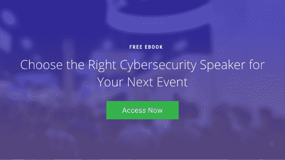

# 如何为您的数字活动找到网络安全演讲者

> 原文：<https://www.mitnicksecurity.com/blog/how-to-find-cybersecurity-speakers-for-your-digital-event>

在过去的一年里，活动策划人在举办活动的方式上发生了巨大的转变。随着新冠肺炎疫情迫使活动数字化，预订者很快将他们过去的舞台才华抛在身后，专注于在在线网络研讨会、演示、社交活动和研讨会方面经验丰富的主持人。

你可能已经意识到，主持一个虚拟演讲者和组织一场面对面的活动完全是两码事。 但是*没有*改变的一件事是对高素质人才的需求，以吸引你的观众。事实上，更重要的是找到一个具有魅力和知识的主持人，这种魅力和知识可以从舞台转移到银幕上。

如果你正在寻找一位网络安全演讲人，让你的观众了解最新的威胁，重要的是要权衡你的选择。网络安全是一个特别难让观众接受的话题。 [你需要一位演讲人，在参与](https://www.mitnicksecurity.com/blog/year-in-review-what-we-learned-speaking-at-virtual-cyber-security-events-in-2020) 的同时接受教育的挑战——他能保持远程与会者的兴趣，如果他们觉得广播无聊，可以轻松脱身。

在过去，你可能会在社交活动中建立联系，但这些面对面的会面在 2021 年并不是一个真正的选择。那现在怎么办？你从网上哪里找网络安全演讲人选择？

您可以从以下几个地方开始搜索:

## 从国家演讲局开始

把演讲人办公室的网站想象成一个展示者的一站式集合。这些小组展示受欢迎的演讲者，给演讲者个人简介以宣传他们的荣誉、演示文稿、联系信息等。你甚至可以在一些网站上看到评论。

主席团网站通常根据不同的主题对发言人进行分组，按照他们擅长的主题进行组织，以便像您这样的活动策划人可以在一个方便的地方轻松查看受欢迎的选择。

[T2】](https://www.bigspeak.com/speakers/kevin-mitnick/)

虽然有几十个发言人办公室可供细读，但对于网络安全发言人来说，**这里有几个著名的中心可供选择:**

*   [国家演讲局](https://nationalspeakers.com/cybersecurity)
*   [大讲T3】](https://www.bigspeak.com/)
*   [思维族长](https://www.thinkingheads.com/en/) 
*   [哈利·沃克](https://www.harrywalker.com/) 
*   [伦敦议长局T3](https://londonspeakerbureau.com/us/)
*   [国家议长局](https://www.nsb.com/) (不要和我们上面链接的混淆)
*   [领导机关](https://www.leadingauthorities.com/) 
*    
*   [华盛顿音箱局](https://www.wsb.com/) 
*    
*   [金喇叭局](https://www.aurumbureau.com/)

***为什么这么多？*** *，*你可能会好奇。你会注意到，这些网站中的大多数都列出了相同的演讲者，然而，演讲者可能在每个单独的局中建立了略有不同的个人资料。

缩小演讲人的选择范围后，你可能想在流行的演讲网站上交叉检查他们的个人资料，以发现新的信息或验证你的初步发现。虽然从技术上讲不是一个局， [eSpeakers](https://www.espeakers.com/) 是另一个寻找网络安全演讲者的优秀社区。

*创造销售线索是您的数字活动的重要目标吗？以下是为 lead gen 网上研讨会选择网络安全发言人的五个技巧* [*。*
T8】](https://www.mitnicksecurity.com/blog/5-tips-for-choosing-a-cyber-security-speaker-for-a-lead-gen-webinar)

## 利用推荐

永远不要低估可靠来源的推荐的力量。如果你在网络安全社区有关系，不要羞于询问他们会为你的数字活动推荐谁。

不同的演讲者可能更适合你的预算或你希望涵盖的特定主题，所以一定要分享一些关于你的设想的细节，以帮助你的推荐人完善推荐。例如，一位网络安全演讲者可能因其现场黑客演示而闻名，而另一位可能是社会工程理论的大师，这极大地影响了你的搜索。

即使你不认识很多网络安全行业的专业人士，在 LinkedIn 或其他社交网站上发表你的兴趣也不会有什么坏处。只需要一个联系就能认识合适的人，或者一个快速的社交分享就能把你的请求扩展到更广泛的社区。

*刚开始预订虚拟活动的发言人？这里有* [*为网上研讨会选择演示文稿时需要注意的八件事。*
T8】](https://www.mitnicksecurity.com/blog/8-things-to-consider-when-booking-a-speaker-for-a-virtual-event)

## 深入挖掘演讲者的在线表现

请确保扩展到他们的演讲机构档案和推荐之外:

### 查看他们的网站

选择了几个选项后，去每个竞争者的个人网站逛逛。他们的网站应该是一个巨大的资源，可以了解他们过去和现在的演讲演出，阅读推荐，访问可下载的资源，如他们的 [预订指南](https://www.mitnicksecurity.com/speaking-information-request-kevin-mitnick) 等等。

### 走向社交媒体

 查看他们的社交媒体资料，就像他们的 LinkedIn 或脸书一样。他们发布了什么内容？看看他们是否仅仅是一个思想领袖，或者他们是否在网上与观众互动。未得到回应或对网络社区缺乏兴趣可能是一个危险信号。

有时，你甚至可以通过查看相似的页面或跟随评论线索来扩大搜索范围，从而找到他们的竞争对手。

### 获取额外资源

你雇佣网络安全演讲人主要是为了他们的教育材料，所以看看他们在舞台之外制作的东西，就能知道会发生什么。如果演讲者主持了播客，请收听几集。如果他们是 YouTuber， [看一些视频](https://www.youtube.com/channel/UCcwpQQvcq-8fRFITzrKp8Hw) 。如果他们是作家，拿起他们的书，或者在亚马逊或 Goodreads 上查看他们的评论。

## 剔除你的选择

虽然查看不同的网站来寻找网络安全演讲者很重要，但如果你不知道如何筛选，看到几十个选项可能会让人不知所措。

有许多因素需要考虑，所有这些因素都会影响您的最终决定，例如:

*   您预订的时间跨度
*   你的观众
*   是选名人还是选思想领袖
*   你的预算
*   等等。

**在我们的** [***选择合适的网络安全主题演讲人***](https://www.mitnicksecurity.com/choosing-the-right-cyber-security-keynote-speaker) **电子书中，我们详细介绍了重要的注意事项和问题，让您的决定变得更容易。**

今天就下载你自己的副本。

