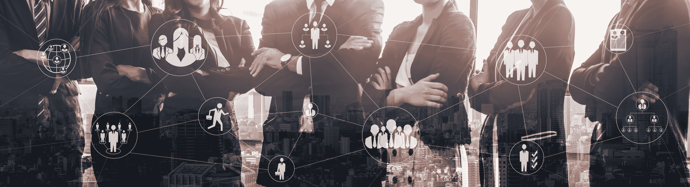

# 用户欺骗:首席信息安全官们正在遗忘的最大网络威胁

> 原文：<https://www.mitnicksecurity.com/blog/user-deception-the-biggest-cyber-threat-cisos-are-forgetting>

作为一名 CISO，您总是在寻找下一个重大突破，以提高您组织的整体安全状况。

下一代防火墙(NGFW)、入侵防御系统(IPS)和复杂的防病毒软件都很棒，但强大的网络安全的答案始于你最薄弱的环节:你的员工。

**事实上，** [**未经培训的员工比 DDoS 攻击或任何其他黑客技术更容易导致漏洞**](https://www.mitnicksecurity.com/blog/5-common-hacking-techniques-for-2020) **。**

在本文中，我们将讨论为什么您的团队是您最大的安全漏洞。此外，在网络安全教育、培训和测试的帮助下，您将获得一些保护您的组织免受用户欺骗的想法。

## 首席信息安全官面临着比以往任何时候都更加严峻的网络威胁。

将所有公司资产存放在办公楼紧锁的门后的日子已经一去不复返了。员工现在在所有不同的地点工作， [远程工作比以往任何时候都更加普遍](https://www.mitnicksecurity.com/blog/endpoint-security-and-remote-work-5-considerations-for-remote-users) 。每一个连接点都是一个新的恶意行为者可以渗透的点。

如今，员工不仅在世界各地工作，他们携带的设备也比以往任何时候都多。智能手机本质上只是包含大量企业数据的便携式电脑，这构成了威胁。

工具、应用程序、云技术和设备的庞大数量在每个转折点都创造了一个切入点。普通人真的知道如何判断一个程序是安全的还是恶意的吗？即使工具或程序本身没有恶意，如果创建者没有安全地设计它，攻击者仍然可以将它作为一种进入的手段。

网络中有如此多的潜在入口，保护它们几乎是不可能的。这种先进的环境迫使首席信息安全官至少在某种程度上依赖他们的员工知道如何保护自己。

## 为什么员工是企业最薄弱的安全环节

一般来说，一般员工是不会故意恶意行为的。当然，也有恶意内部人员出于恶意或金钱利益而试图对组织造成破坏的情况，但这远不如员工意外造成损害常见。根据 KnowBe4，只有 3%的攻击依靠恶意软件来利用技术缺陷； [另外 97%依靠社会工程战术！T3】](https://www.knowbe4.com/what-is-social-engineering/)

[社会工程利用了每个人天生的](https://www.mitnicksecurity.com/blog/social-engineering-attacks) 本能，即信任看似合法的东西。社会工程师使用开源智能(OSINT)来收集关于他们潜在目标的信息。脸书或 LinkedIn 等社交媒体网站和面向公众的网站上的信息为一个坏演员提供了大量数据。通过充分了解您，攻击者可以对您和您的组织发起令人信服且有针对性的攻击。

没有经过识别社会工程攻击的适当培训，员工很容易成为攻击者的攻击目标。即使有世界上所有的安全控制，成功的、复杂的社会工程攻击还是会发生。当攻击只能通过电话进行通信时，没有任何软件可以保护您。

记住所有这些，就不难看出你的员工是你最薄弱的一环。尽管如此，如果有足够的网络安全教育和培训，员工也可能是你最后和最好的防线。能够快速准确地发现网络钓鱼邮件的员工远比经历误报和漏报的垃圾邮件过滤器更有价值。

## 进攻和防守的重要性

在网络安全的世界里，最好的防御最终是主动出击。简而言之，这意味着首席信息安全官必须积极主动，而不是被动应对潜在的网络威胁。

攻击性思维包含两种方法:

1.  先于对手了解您组织的弱点
2.  在危险发生之前，对你的员工进行网络威胁的培训

针对您组织的模拟攻击，无论是通过全面的 [渗透测试](https://www.mitnicksecurity.com/penetration-testing) 还是简单的模拟钓鱼攻击，都可以让您深入了解组织的弱点在哪里。当然，全面渗透测试或 [红队参与](https://www.mitnicksecurity.com/red-team-operations) 提供了对组织的更深入了解——从整体上以及从技术和教育的角度来看存在的缺陷。

了解你的员工最有可能上当的技术，使你能够针对那些策略和战略开发定制的社会工程培训。 [根据 KnowBe4，](https://www.knowbe4.com/hubfs/SecurityAwarenessTrainingDeploymentsDeterDefeatHackers.pdf) 进行的一项调查，84%的受访者表示，在对其员工实施社交意识培训后，他们可以看到社交工程攻击的可量化减少。

[**以下是所有首席信息安全官应该向远程用户传授的顶级黑客技术**](https://www.mitnicksecurity.com/blog/top-hacking-techniques-all-cisos-should-educate-remote-users-about) **，让你思考你的团队需要的培训。**

## 最近的企业社会工程攻击

T2】

不要认为它会发生在你身上？著名的商业专家和《鲨鱼池》的主持人芭芭拉·科克兰可能也有同感。也就是说，直到今年早些时候她陷入了一个网络钓鱼骗局 [，花了她 38 万美元](https://www.forbes.com/sites/rachelsandler/2020/02/27/shark-tank-host-barbara-corcoran-loses-380000-in-email-scam/#1d27351b511a) 。

在这种情况下，骗子做了他们的研究。用于向 Corcoran 发送钓鱼邮件的电子邮件地址与 Corcoran 助手的电子邮件地址非常相似。事实上，只有一个角色不同。这封邮件包含一张 388，700.11 美元的“房地产翻新”非法发票。由于科科伦投资房地产，这封邮件最初并没有给她带来任何危险。

在骗局的消息爆出后，科科伦在推特上写道:“吸取的教训:汇款时要小心！”

Barbara Corcoran 并不是近年来唯一一个被网络钓鱼欺骗的人。事实上，知名公众人物和组织成为社会工程攻击受害者的例子数不胜数——其中最值得注意的是 2016 年美国总统大选中的民主党。

在 2016 年总统大选之前，来自俄罗斯的恶意行为者向民主党全国代表大会的网络成员发送了鱼叉式钓鱼电子邮件。结果攻击者 [获得了数千封关于民主党候选人希拉里竞选的机密和敏感邮件](https://www.cnn.com/2016/12/26/us/2016-presidential-campaign-hacking-fast-facts/index.html) 。

点击此处了解过去十年中最大的社交工程攻击。

## 立即开始保护您的组织

作为 CISO，有两种方法可以提高组织的安全性...

第一是投资员工网络安全教育和培训，让员工在点击前有所思考。

第二是要明白，即使准备最充分的人也可能成为狡猾的社会工程借口的受害者，并选择自定义测试或红队活动来发现您在安全方面的潜在差距。

在采取任何一种方式之前，看看你的公司对网络威胁的准备程度。

通过 [在此](https://www.mitnicksecurity.com/lp-easy-steps-to-avoid-cyber-threats) 下载我们的指南，只需 5 个简短但影响深远的步骤，即可获得保护您组织的可行技巧。

