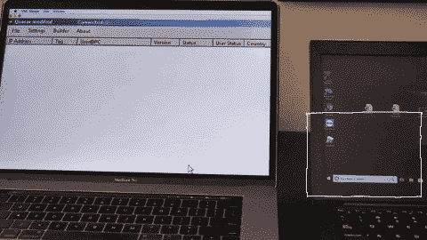

# 最新的恶意软件威胁:USB 忍者电缆

> 原文：<https://www.mitnicksecurity.com/blog/the-latest-malware-threat-the-usb-ninja-cable>

您刚刚用最新的病毒定义和安全补丁更新了您的笔记本电脑，并且您认为，“好了，我现在安全了！”

不幸的是，这不一定是真的。网络罪犯和黑客总是想出巧妙的新方法来利用你的设备，你必须时刻保持警惕。

特别是恶意软件的威胁，对企业和个人用户来说都是相当危险的，而且还有一种新的攻击要提防:USB 忍者电缆。

在本帖中，我们将介绍这种感染恶意软件的方法是什么，需要注意什么，以及如何保护您的企业不被利用。

## USB 忍者线是什么？

[USB 忍者电缆](https://hackerwarehouse.com/product/usb-ninja-cable/)是一种 USB 电缆，旨在用恶意软件感染连接的设备。这种恶意电缆的工作原理是在插入 USB 友好设备时向您的计算机注入击键。

**这些击键允许攻击者下载恶意软件并感染您的设备，**通常是通过远程访问您的私人文件。

[//www.youtube.com/embed/Le6LP43SHcM](//www.youtube.com/embed/Le6LP43SHcM)

## 黑客后来能做什么？

恶意软件是故意设计来对您的设备或网络造成损害的恶意软件。它有多种形式，包括计算机病毒、蠕虫、特洛伊木马、勒索软件、间谍软件、广告软件等。

**USB Ninja 电缆可以被设计成携带多种形式的恶意软件，它们都具有不同的影响。**一个例子可能是坏人获得了您的私人文档和文件的独家访问权，并以此为要挟，直到您付钱将它们释放。这种“勒索软件”攻击是一种常见的做法，如果支付，对黑客来说会变得非常有利可图，但对您的企业来说成本非常高。

## 如何区分忍者线和普通 USB 线？

这就是可怕的地方——你不能。USB Ninja 电缆看起来和摸起来就像任何普通的 USB 电缆。没有明确的方法可以简单地通过将它握在手中来确定它是否是一根受感染的电缆。

当插入您的设备时，Ninja 电缆在功能上也与任何其他 USB 一样。例如，在上面显示的凯文·米特尼克的现场演示视频中，你会看到当将手机插入电脑时，USB 电缆仍然允许手机充电。因此，许多人都不知道电线有问题。

 

## 你没看到攻击发生吗？

当设备在一段给定的时间内不活动时(比如说，闲置 5 分钟后，而黑客认为您没有看管设备)，可以将感染您的计算机的注入式击键设置为激活，并运行一个快速的 5 秒钟命令来感染您的计算机。

击键注入可以运行得如此之快，很容易被错过。这就是为什么这个 USB 漏洞如此危险:它超级有效，几乎无法检测。

## 你如何保护自己？

尽管您无法将 Ninja USB 电缆与普通 USB 线区分开来，但您可以做一些事情来避免这种类型的恶意软件注入:

### 1.要知道不仅仅是 USB 线。

网络犯罪分子还可以破坏其他形式的设备电缆，如 USB-A 和 USB-C 线、微型 USB、lightning 电缆、 [USB 棒](https://www.youtube.com/watch?v=7skDckKti6w)(又名闪存驱动器)等。他们甚至可以将电脑鼠标武器化，用一根线插入你的 USB 接口。

### 2.要知道没有任何设备是安全的。

一些用户认为 Macbooks 是不可能被黑的，或者他们的装有杀毒软件的 PC 是安全的。这是不正确的，所有设备都容易受到忍者 USB 电缆攻击。

### 3.跟上不断变化的威胁形势。

网络威胁总是在变化，因为黑客们的攻击越来越有创意。与新威胁保持同步至关重要，如 USB Ninja 电缆等。

### 4.对你的员工进行安全意识培训。

合适的网络安全团队可以为您的团队提供有用的见解，以抵御恶意软件威胁。安全意识专家可以教给你的员工的一些事情包括:永远不要在多个网站上使用同一个密码，永远不要插入你不知道来源的设备，永远不要扔掉数据或硬盘，等等。(开始教育你的员工的一个好地方是给他们分配[其中一本网络安全书籍](/bestselling-books-by-kevin-mitnick)来阅读)。

## 停下来，看看，想想

避免 USB 忍者电缆攻击的最佳方法是在插入任何设备之前“停下来，看一看，想一想”。

偷偷用一根被感染的 USB 忍者相似物替换一根普通电缆比你想象的要容易。例如,“新包装盒”的电话线可以预先包装好，看起来就像是在包装中一样，但实际上是在给新员工提供新的工作电话之前更换的。

**您的数据面临着前所未有的风险，而且风险每天都在增加。因此，寻求专家的建议来保护你的资产是至关重要的。**

## 凯文·米特尼克的现场演示和认知培训

通过世界上最著名的黑客凯文·米特尼克的现场安全意识演示，亲自向您的团队展示 USB 忍者电缆攻击的样子。Mitnick 是 whitehat 的“机密威胁演示者”,他可以向您的团队传授减轻威胁的最佳实践。今天就预定 Kevin 作为主题演讲人。

