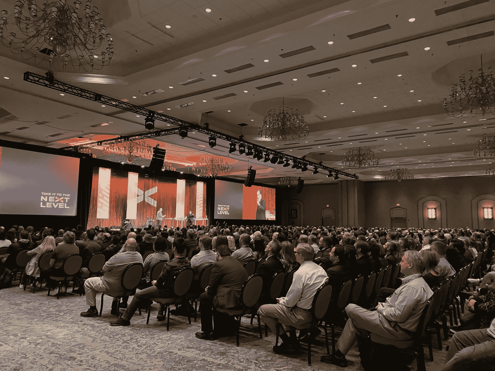

# 在你的下一次企业活动中将教育和娱乐相结合的 4 种方法

> 原文：<https://www.mitnicksecurity.com/blog/4-ways-to-combine-education-entertainment-at-your-next-corporate-event>

想象两种类型的事件:公司圣诞晚会和季度强制安全意识培训。

我们可以猜测你最期待的是哪一个。我们都参加过相当一部分非个人的或乏味的公司活动。虽然 [让员工了解网络威胁](https://www.mitnicksecurity.com/blog/educate-your-remote-users-about-cybersecurity-with-these-tips) 对于保持健康的安全态势至关重要，但在这些事件中保持员工的注意力可能具有挑战性。

许多公司似乎很难将庆祝等聚会的乐趣与培训或公司会议的教育性结合起来。

在教育和娱乐之间找到正确的平衡需要适当的计划和正确的工具来完成工作。

以下是四种策划寓教于乐的企业活动的方法:

## 1。让它成为一种体验

许多演示迫使观众作为被动的成员坐着。这种类型的演讲经常导致演讲太长、太枯燥，而且很少能有效地传达任何信息。

**成功的事件将观众带入当下，鼓励他们感受到展示的一部分。**合适的演讲者将通过提问、活动和其他技巧积极吸引观众。如果观众认为他们可能被邀请了，他们更可能提供他们的关注，而不是在他们的移动设备上进行区域划分或滚动。

## 2。选择合适的扬声器

为你的听众选择合适的演讲者可以决定你公司的成败。许多组织选择内部演讲者的路线，但带来一个“特殊的客人”更有可能抓住你的观众的注意力。著名的行业专家为任何教育聚会提供价值，同时保持它的刺激性和娱乐性。

虽然一些演讲者可能擅长于现场活动，但他们的个性可能不会在虚拟活动 中展现出来，反之亦然。在确定活动是面对面还是虚拟的之后，确定你考虑的演讲者是擅长某一种活动，还是擅长物理和虚拟演讲。

对于虚拟活动，请确保您的扬声器具有适当的音频和视频功能，以提供最高的质量。虚拟事件参与者应该感觉好像他们和演讲者坐在同一个房间里。 [点击此处阅读更多为您的虚拟会议预订发言人的技巧。T3】](https://www.mitnicksecurity.com/blog/tips-for-event-planners-booking-a-speaker-for-a-virtual-conference)

此外，你为公司活动雇佣的任何演讲者都应该提供一个有趣的故事，这就引出了我们的下一点。

## 3。讲故事

故事是吸引观众的绝佳方式。如果这是一个有趣的故事，那就更是如此了！有引言、高潮和解决方案的真实故事就像读一本伟大的书或看一部电影。这些故事将抓住听众的注意力，并在教育内容播放时保持住。

寻找一位在提供教育内容的同时完善了讲故事艺术的演讲者。

要理解社会工程、黑客和网络威胁的风险，还有什么比听一个生活在法律光谱两边的人讲述真实的故事更好的方式呢？

## 4。给出真实世界的例子

当其他人告诉我们可能的威胁时，作为人类，我们很容易将它们一笔勾销，并得出结论说这永远不会发生在我们身上。使用真实世界的例子是一种很好的方法，可以将观众和一个想法联系起来。

听众可能会在受害者或事件中的人物身上找到相似之处，并在某种程度上与他们产生共鸣。这就建立了一种联系，有助于让听众明白一个观点，并迫使他们更好地记住刚刚收到的信息。

## 选择合适的演讲者

随着新冠肺炎在 2020 年的警告，许多公司正在转向虚拟活动。以下是预约数字演示者时需要考虑的 8 件事。T3】

相信我们，我们知道在您的企业活动中找到教育和娱乐的完美结合绝非易事。因此，我们开发了一份信息丰富的指南来帮助您做出决定。

下载我们的免费 [*选择合适的网络安全演讲人* 指南，自信地聘请最好的网络安全演讲人。](https://www.mitnicksecurity.com/choosing-the-right-cyber-security-keynote-speaker)

