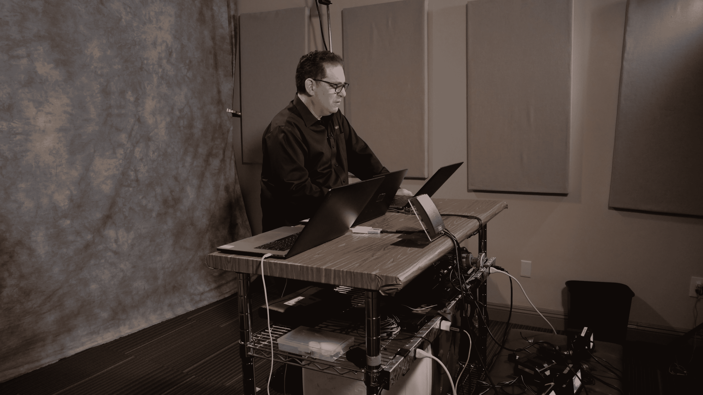

# 现场活动无法提供的虚拟网络安全活动的 5 大优势

> 原文：<https://www.mitnicksecurity.com/blog/benefits-virtual-cybersecurity-events-over-in-person-events>

如果你想预定一个网络安全演讲人，很有可能你是考虑数字广播的。毕竟，新冠肺炎疫情让活动策划人几乎不可能亲自举办活动。

但随着社交距离限制的消长，问题来了:*我现在应该在网上还是亲自举办活动？*

除了新冠肺炎的风险之外，举办网络安全培训、教育研讨会或虚拟黑客演示还有许多充分的理由。以下是数字活动提供的五个好处，而现场活动可能没有:

## 1.出席指标

活动组织者通常会在参加网络安全活动之前要求注册，以免根据场地的容量超售座位。然而，面对面的活动会让人们更难看到谁会真正参加，以及参加多长时间。并不是所有的现场活动主持人都对到场的人进行连续记录，只在门口寻找注册证明，而不记录具体的名字。即使他们检查了名字，也很难跟踪谁在整个活动中留下来。

虚拟活动平台可以捕捉关于谁点击了活动的出席链接的信息，也就是“出席”此外，由于一些托管平台提供对与会者是否参与的洞察，您可以看到谁中途离开，甚至谁开始“不参与”。这在员工培训虚拟活动后非常有价值，可以看到谁没有完全参加，以加强您的教育。

## 2.更多与会者，没有场地限制

主办方要求注册网络安全活动的部分原因是因为场地限制。这个空间只能容纳一定数量的人，而更大的场馆价格更高。

然而，在举办虚拟活动时，很少会有与会者人数的上限。这对于有数千人参加的大型组织或活动尤其有用。例如，我们自己的凯文·米特尼克一直在预订超过 5000 个注册的演示——这将需要一个巨大的场地来容纳。有了虚拟活动，比起寻找新的场地，为更多的参与者腾出空间更容易。

新冠肺炎的限制也导致大型活动要么被大幅缩减，要么被重新安排，使得虚拟网络安全活动成为安全接触大多数人的唯一现实途径。

## 3.选择网络安全扬声器时限制更少

在为现场活动选择网络安全演讲人时，有一些令人头疼的问题需要考虑。一些演讲者将只在特定的地点演讲，从地理上限制你或者完全排除他们的选择。即使演讲人愿意出差参加活动，面对面的演讲人通常需要沿途的交通和住宿费用。

**为某项活动预订虚拟发言人时，此人可以从*任何*地点进行广播。例如，我们自己的凯文·米特尼克可以从世界任何地方向美国国内的公司广播。**

但有时选择太多同样会让人不知所措。好消息是，在审查数字活动的网络安全发言人时，你可能会注意到，并不是每个人都胜任这项工作。一些主持人没有主持虚拟活动的经验，不熟悉视频主持平台。这仅仅是开始。以下是在为虚拟活动预约演讲人之前需要考虑的另外七件事。T3】

## 4.来自活动的反馈

在面对面的活动中，并不总是有机会在演示期间或之后分享建设性的反馈。为了节省时间，许多演讲者会让观众把问题留到最后——有时嘉宾会在演讲结束后留下来参加问答环节，但并不总是这样。更多的时候，人们没有分享任何关于他们经历的细节就离开了。

**在虚拟广播中，与会者可以更轻松、更少干扰地将问题留在内置的聊天功能**中，以便演示者或主持人在最后讨论。通过这种方式，问题可以在出现时就提出来，不会忘记任何询问。如果演示被录制下来，那些不能留下来回答常见问题的人可以随时观看，以确保他们没有错过任何重要的讨论。

此外，这为需要更多时间和解释来回应的问题留下了事后跟进的空间！

## 5.可重复使用和可跟踪的记录

发布现场活动的目的是让客人现场体验这一时刻。但是，对于一个阶段性的会议来说，每个人都旅行或聚集在一个团体环境中通常是不可能的。当参加虚拟活动时，许多同样的挑战并不适用。观众不仅可以在家舒适地参加，那些不能进行现场直播的人也可以稍后观看录制。

突然之间，网络安全意识培训演示不一定要在部门之间进行紧张的协调——所有部门都试图找到一个适合每个人的时间。无法参加的员工可以稍后观看虚拟活动。即使是那些参加了的人也有可靠的录音来重新观看和做笔记。

公司还可以选择将演示文稿上传到特定的 URL，这样你就可以在直播结束后跟踪谁在观看和参与你的视频。这很容易让人们对观看演示负责，即使他们不能参加直播。

另一方面，你也可以在你的营销材料中使用由你的公司共同赞助的虚拟活动录音，使你的努力达到双重目的。

## 需要帮助选择一个发言者？

为你的网络安全活动选择一个虚拟演讲者和雇佣一个真人演讲者是非常不同的。

你需要一个擅长讲故事的人来吸引屏幕后面的参与者，并且需要一个能够让虚拟会议感觉像是一种高级体验的人，而不需要离开桌子。

下载我们的指南 [***选择合适的网络安全主题演讲人***](https://www.mitnicksecurity.com/choosing-the-right-cyber-security-keynote-speaker) 了解在审查你的下一位大演讲人时应该问的所有问题。

