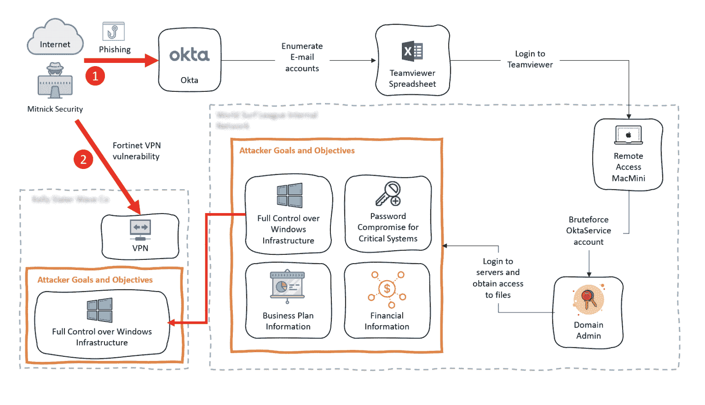
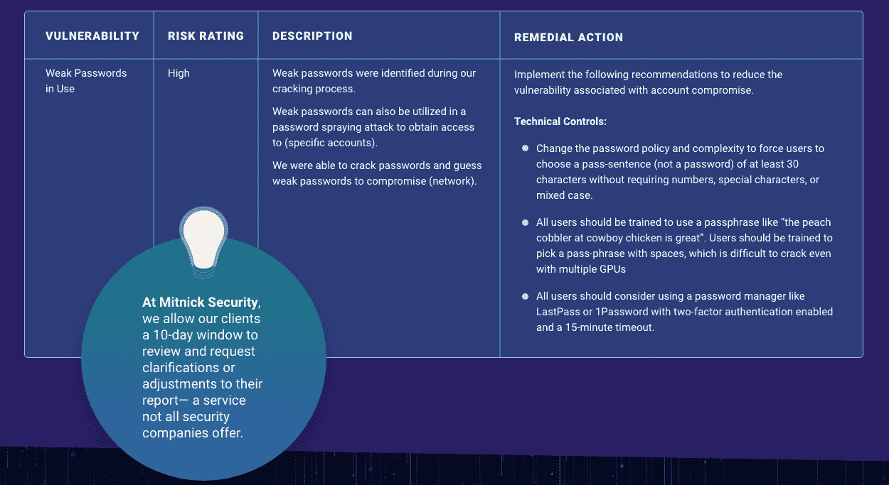

# 解码测试报告术语:终极术语

> 原文：<https://www.mitnicksecurity.com/blog/decoding-pentesting-report-lingo-the-ultimate-glossary>

你知道 [渗透测试对运行](https://www.mitnicksecurity.com/blog/why-penetration-testing-is-more-important-than-ever-in-2020) 很重要——越来越多的公司将它们整合到年度网络安全计划中。

尽管渗透测试可能有价值，但许多企业并没有充分利用其结果。这并不是说他们故意忽视提高安全性，他们只是不知道如何 [【解码】测试报告结果](https://www.mitnicksecurity.com/blog/whats-included-in-a-penetration-test-report) 。

这是因为许多测试报告充斥着高管和其他决策者不理解的“技术”词汇。

不要让你的渗透测试报告吓倒你。你所需要的只是一个词汇表，把行业术语翻译成外行人的术语。

没有网络安全背景的人可能需要解释以下一些令人头疼的词汇:

## 1.范围

当您第一次打开您的 pentesting 报告时，在最初的*概述*部分之后，您将看到的第一个部分是*目标&范围。*虽然您可能知道*目标*是 pentest 本身的“目标”,但是*范围*定义了该项目的具体细节以达到目标。

范围概述了将要测试的所有内容以及将从攻击中排除的内容。它将详细说明渗透测试人员可以追踪的网络、应用程序、数据库、账户、人员、物理安全控制和其他资产。

这种*目标&范围*甚至常常 [定义测试项目的类型](https://www.mitnicksecurity.com/blog/understanding-the-6-main-types-of-penetration-testing) ，例如外部网络或应用测试，因此您可以确定地知道重点在哪里。

### 范围示例:

您的报告可能将目标定义为获得对某个网络的访问权限，并将其与范围联系起来:

*试图通过任何攻击性网络安全措施获取对(名称)内部网络的访问:*

*-社会工程
-无线网络妥协
-外部网络
-外部网络应用*

范围还包括您同意的项目时间表。

## 2.攻击媒介

在讨论了您的*范围*并简要概述了 pentesters 发现的问题后，报告将详细说明他们如何危害您的系统的细节。该报告将解释他们用来攻击你的*攻击媒介*，这只是一种描述他们获取你的数据的途径的奇特方式。

### 攻击路径示例:

在你的深入报告中，会有一份关于圣灵降临者成功破解你的系统的书面解释。这种攻击方式有时会用图像来说明，特别是当路径有许多步骤并且变得复杂时。

在下面的示例中，您可以看到黑客使用了“ [”网络钓鱼](https://www.mitnicksecurity.com/blog/spear-phishing-targeted-email-scams-what-you-need-to-know-about-this-hacking-technique) ”的攻击路径来访问客户正在使用的重要云软件服务，并“利用 VPN 漏洞”来访问他们的虚拟专用网络。

[在这里了解更多关于渗透测试的攻击阶段。T3】](https://www.mitnicksecurity.com/blog/the-4-phases-of-penetration-testing)

## 3.时序攻击叙事

在 pentest 中，通常会有多个攻击媒介，每个媒介都涉及从最初的入侵到 pentesters 正在寻找的信息的复杂路径。正因为如此，圣灵降临节经常会用详细的叙述来解释旅程，就像讲述他们如何从 A 点到达 B 点(然后是 C，D，E，等等)的故事。).

按时间顺序排列的攻击叙事按照攻击顺序展示了圣灵降临者是如何施展魔法的。它通常会详细描述参与活动的图片或截图，如 pentester 发出的 [社交工程电子邮件](https://www.mitnicksecurity.com/blog/ways-hackers-use-social-engineering-to-trick-your-employees) 称，一名员工点击了他们能够看到和访问的服务器中的受感染链接或文件夹。

### 按时间顺序叙述的例子:

**{插入姓名}服务器的权限提升**

*   **利用{在此处插入姓名}漏洞。**本节将详细介绍 pentester 如何注册用户、向帐户添加 SSH 密钥以及使用 pen tester 生成的私钥执行攻击。然后，他们可能会分享这如何允许他们以“root”身份执行某些命令

*   **获得{在此插入姓名}密钥的访问权限。**在这里，pentesters 可能会显示截图和他们进入用户主文件夹的步骤，他们在那里找到了一个 SSH 密钥，该密钥可以访问几个生产服务器，并且是一个拥有 SUDO 权限的管理员用户。

*   **解码{特定资产}。一旦 pentesters 获得了某些文件，他们可能会解释他们是如何编写并使用脚本来解密这些文件的。**

*   **等。**

这只是对 pentesting 报告中相当长的部分的一个高层次的观察。每个叙述都是独一无二的，通常会展示许多具体的截图和攻击媒介的示例以及由此导致的升级。

想更好地理解 pentesting 报告的这一部分吗？ [了解更多 *编年攻击叙事* 此处](https://www.mitnicksecurity.com/blog/the-anatomy-of-a-penetration-testing-report-an-infographic) 。

## 4.横向运动

通过阅读你的*攻击载体*和*时序叙述*，你会注意到攻破一个系统有很多步骤。通常情况下，做一件事并不能获得对整个数据库的完全访问权。

在攻破一个系统后，黑客会使用多种技术进入网络的更深处，以发现更敏感的信息。攻击者会保持低调，不让人注意到，同时在环境中横向移动以收集更多信息。

### 横向运动的例子

横向移动有三个阶段——侦察、凭证/特权收集和获得对网络中其他计算机的访问权——如果您有兴趣，您可以进一步探索:

*   第一阶段-侦察:

This is where the attacker explores your network, your users and devices on the down-low, gaining information to use against you in clever social engineering exploits.

An example would be performing extensive OSINT research to devise a clever pretext for baiting an employee.

*   **阶段 2 -凭证/权限升级:**一个社交工程欺骗他们的目标共享私人信息，从而获得私人登录。

An example of this stage of lateral movement would be a social engineer posing as IT, walking the target through a password reset— in which they learn the new password.

*   **阶段 3 -获取访问权限:**一旦进入网络，内部侦察就会开始，直到不良行为者深入系统，横向移动他们当前的访问权限并提升权限而不被发现，直到他们获得他们想要的东西。

    一个例子是，攻击者进入一个用户的凭证，找到一个登录重要门户网站的密码文档，从而解锁对榨汁机数据的访问。

## 5.权限提升

Pentesters 知道某些用户比其他用户拥有更高的权限，这些权限授予他们访问敏感数据的权限。考虑到这一点，pentester 的目标通常是直接获得对高权限用户的访问权限(称为*垂直升级*)或者获得较低权限级别的用户并“升级”他们的权限(*水平升级*)。

凭借这种更深入的可访问性，pentest 可以横向深入网络，以访问受保护程度更高的数据槽。

### 权限提升的示例:

一旦进入高权限级别用户的计算机，pentester 就可以看到您的设备上正在运行哪些服务，以及哪些用户正在运行这些服务。从那里，他们可以将恶意代码注入到您的进程中。这可能允许他们从进程所有者(如域管理员)那里检索特权，否则会给他们提供对私有数据的未授权访问。

## 6.技术漏洞

通读攻击叙述后，您的测试报告通常会列出您的*技术漏洞*。这些是 pentesters 发现的安全漏洞——给出了名称和描述。

### 技术漏洞示例:

您可能在 pentesting 报告中看到的一个技术漏洞可能是“端点保护不足”该报告可能会解释说，在他们的测试中，他们发现了以下情况:

*使用的终端安全解决方案(公司名称)是(防病毒品牌)。*

防病毒解决方案没有带来任何额外的复杂性，在整个项目中也没有必要绕过它。

*该解决方案没有阻止我们的安全公司使用的任何渗透测试非恶意软件。*

*T2】*

## 7.风险评级

您的 pentesing 报告中列出的每个技术漏洞都将被给予一个*风险评级*，通常由以下内容组成:

1.  关键风险
2.  高危
3.  中等风险
4.  低风险
5.  信息(无风险)

每个 pentesting 公司可能有自己的定义，这些个人风险评级意味着什么，但一般来说，他们的权重是相似的。

### 风险评级示例:

在 Mitnick Security，我们的风险评级系统如下:

*   **危急风险。**攻击者可能会滥用此漏洞来立即获得代码执行权，或危及组织内高度敏感的资产和信息。

*   **高风险。**结合利用此漏洞和另一个弱点的攻击者将能够获得对组织内高度敏感信息的访问权限。

*   **中等风险。**攻击者必须将这种难以利用的漏洞与多个其他漏洞结合起来，才能访问组织内的高度敏感信息。

*   **低风险。**这些漏洞不太可能被单独利用，通常与中等风险或更高风险的漏洞结合使用，以获取对组织内高度敏感信息的访问权限。

*   信息性的。没有直接给组织带来风险。此类漏洞可与典型的对抗技术结合使用，以攻击目标组织。

## 8.补救措施

在您了解您的技术漏洞及其风险评级后，测试报告将包括一个*补救措施*列表，这些措施是您如何修复安全漏洞的关键要点。

### 风险评级示例:

“终端保护不足”风险为中等的客户端可能会收到以下补救建议:

*应部署端点检测和响应(EDR)解决方案，为工作站和服务器提供现代防护。*

大多数 EDR 代理可以支持 Windows 和 macOS，并且可以将日志方向输入 SIEM。

## 详细的 Pentest 报告的力量

现在你已经了解了一点 pentesting 报告中使用的术语，你是否更有信心将你的结果很好地利用起来？

通过 [阅读他们的案例研究](https://www.mitnicksecurity.com/cybersecurity-case-study-world-surf-league) ，了解我们世界级的 pentesters 如何帮助世界冲浪联盟提高他们的安全性，并从我们在 Mitnick Security 的团队那里获得业内最详细的报告之一。