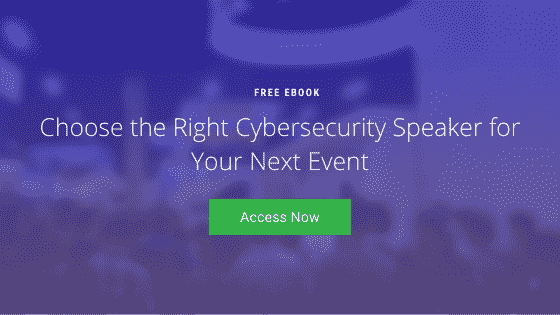

# 网络安全演讲者如何在 2021 年提供价值

> 原文：<https://www.mitnicksecurity.com/blog/how-a-cybersecurity-speaker-can-provide-value-in-2021>

又一年过去了。但这一次，我们中的许多人非常高兴它终于结束了！

毫无疑问，疫情让 2020 年成为无数行业充满挑战的一年。许多人被迫迅速转向远程操作以维持运营，在此过程中创造了一个全新的威胁环境。

尽管许多企业尽了最大努力来改善他们的安全基础设施，以减轻在家工作的风险，但网络罪犯并没有被打败。他们只是在寻找更聪明的进入方式。

这些疫情剥削者的不懈努力刺激了对更好的安全意识培训的日益增长的需求。但也不全是在线测试和安全认证。随着越来越多的企业争相教育他们的用户远程工作的危险，越来越多的公司预订网络安全演讲人来主持数字研讨会。

我们不能责怪他们。就员工安全培训而言，在 2021 年，雇佣一名网络安全演讲者是强化你的安全的一个奇妙的开始。

今年，安全演讲人可以通过以下几种方式帮助您的企业:

## 一位网络安全发言人可以向您的团队介绍最近的网络诈骗。

虽然你知道网络威胁发展迅速，但你可能会惊讶于如今它们的发展速度有多快。特别是从 2020 年到 2021 年，网络犯罪分子一直在利用以新冠肺炎 T5】为中心的[T3】新黑客技术。](https://www.csoonline.com/article/3532825/6-ways-attackers-are-exploiting-the-covid-19-crisis.html)

工作环境的转变只是为他们的社会工程攻击火上浇油，精心策划了 [聪明的疫情网络钓鱼计划](https://www.mitnicksecurity.com/blog/2-ways-hackers-may-trick-you-using-covid-19-phishing-schemes) ，利用新发现的远程漏洞，甚至策划废弃办公室的物理入侵。

##### 查看我们的[*2021 年黑客技术预测*](https://www.mitnicksecurity.com/blog/hacking-technique-predictions-for-2021-the-top-threats-to-watch) 先睹为快，了解一些在网络安全研讨会上需要注意的威胁。

这还不是全部。合适的网络安全演讲人不仅应该了解这些最新技术，还应该围绕这些不断演变的威胁将演讲重点放在教育上。当 [为你的下一个活动](https://www.mitnicksecurity.com/blog/8-things-to-consider-when-booking-a-speaker-for-a-virtual-event) 预约演讲者时，一定要要求看他们的演示文稿，并确保它包含相关的现代场景。

## 实时黑客将“显示而不是告诉”您的团队需要注意什么，从而提高参与度。

毫无疑问，跟上最近的漏洞利用可以增强您的团队识别新兴诈骗所需的洞察力。但是知道和亲身经历是有区别的。虽然你的团队成员不会被实时攻击，但他们可以在现场演示中观看黑客的行动。

由于会议取消迫使 2020 年转向虚拟活动，许多网络安全专家将他们通常的现场演示改为在线网络研讨会媒体。虽然我们仍然不确定 2021 年现场演示是否会卷土重来，但有一点是肯定的:虚拟活动将保持强劲。

为了赢得屏幕后观众的注意， [网络安全演讲者需要将教育与娱乐结合起来](https://www.mitnicksecurity.com/blog/4-ways-to-combine-education-entertainment-at-your-next-corporate-event) 。一个能够讲述吸引人的故事，帮助观众更好地理解真实世界的例子*和*现场展示黑客的演讲者肯定会留下持久的印象，并且是今年你安全预算中值得的投资。

## 以问答结束的网络安全演示会引起好奇心。

在对您的团队进行网络安全最佳实践培训时，人们可能会有疑问。有时它可以提供答案，但员工可能会觉得不好意思打扰他们。

指定的网络安全活动，最后有问答环节，直接鼓励个人站出来深入探讨。在这些重要的一对一讨论中，您的团队可以澄清任何困惑或阐明他们所学到的东西，这是传统培训视频或课程无法提供的。

随着如此多的现场互动活动被录音所取代，选择一位(至少)参与现场问答总结的安全演讲者就变得更加重要。

## 此外，安全性网络研讨会还可用于挖掘销售线索。

虽然让您的团队了解网络威胁的危险本身就是一个巨大的胜利，但您的安全演示不仅仅是意识培训。

如果你计划通过举办一次网上研讨会向更多的观众开放你的虚拟活动，考虑一下你能转化合适的潜在客户的所有方法。这可能需要对你的理想人物角色进行一些研究，并掌握一些有针对性的广告技巧——但最终，努力工作会有回报的。

##### 考虑举办一场以性别为主题的网络研讨会？ [这里有 5 个让你入门的小技巧](https://www.mitnicksecurity.com/blog/5-tips-for-choosing-a-cyber-security-speaker-for-a-lead-gen-webinar) ！

2021 年，用一堂急需的网络安全课给你的员工、合作伙伴和潜在客户留下深刻印象。

## 你的活动和你的演讲者一样有价值

虽然你可能会做所有正确的事情来 [主办和策划一场令人难以置信的网络安全活动](https://www.mitnicksecurity.com/blog/how-to-plan-and-host-an-incredible-virtual-event) ，但预约一个不起眼的演讲者可能会破坏你的最佳努力。

选择一个安全演讲者不是一件简单的任务，但是我们认为我们通过整理一本有用的指南使它变得简单了一点...

**在我们的** [***选择合适的网络安全主题演讲人***](https://www.mitnicksecurity.com/choosing-the-right-cyber-security-keynote-speaker) **电子书中，我们详细介绍了挑选一名出色演讲人的一些技巧。其中一些肯定会派上用场。今天就免费下载您自己的副本。**

