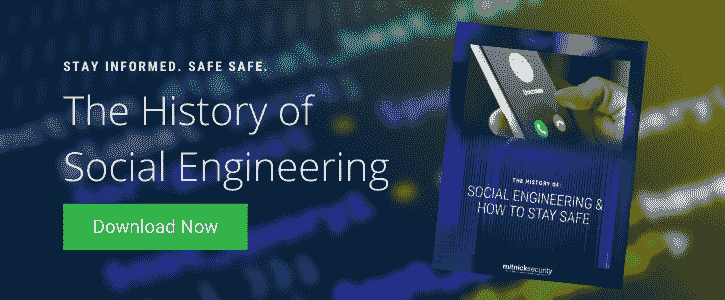

# 当您投资于 Mitnick Security 的社会工程测试时，您会得到什么

> 原文：<https://www.mitnicksecurity.com/blog/investing-in-social-engineering-testing-with-mitnick-security>

您让您的团队接受了 [社会工程培训，让他们了解了网络犯罪的危害。T3】](https://www.mitnicksecurity.com/blog/social-engineering-training-what-youre-really-paying-for)

但是这项投资值得吗？您的员工是否真正学会了如何识别网络钓鱼邮件、如何设计和使用更强的密码以及如何更好地保护您的系统？

现在是检验他们记忆力的时候了。但问题是，并不是所有的社会工程测试人员在专业知识、技能和毅力方面都是平等的。

当测试你的员工的社会工程准备程度时，你的团队需要模拟攻击，这些攻击可能来自一个严肃的工程师，而不是那些只触及一个真正的坏演员能力的表面的陈腐的诈骗邮件。

这仅仅是开始。以下是我们 Mitnick Security 的白帽社会工程师在竞争中脱颖而出的所有原因:

## 1.高级工程师。

当你雇佣一家公司进行社会工程测试时，你需要一个经验丰富的专业团队。不幸的是，其他测试公司经常采取简单的方法:雇佣一两个高级工程师来管理经验较少的测试人员。这意味着你永远不知道谁在精心制作网络钓鱼邮件，或者他们是否有实践经验来建立一个成功的社会工程活动。

有了 Mitnick Security，**我们*只*雇佣至少有 10 年经验的资深社会工程测试员。**这种只对顶尖人才的专属奉献是我们引以为豪的一个重要原因，即在小型到数百万美元的企业中，使用社会工程破解系统的成功率高达 100%。

## 2.高于并超越奥辛特。

真正的社会工程师严重依赖[【OSINT】](https://www.mitnicksecurity.com/blog/how-social-engineers-use-your-digital-footprint-against-you)开源情报，在网络钓鱼骗局中编织令人信服的叙事，或者打破技术防御。他们经常使用你认识的人或公司高层管理人员的名字、特定行业的语言/行话和其他互联网上可以获得的信息 [来获得信任和权威](https://www.mitnicksecurity.com/blog/the-most-popular-cyber-attack-social-engineering) 。

问题是，**很多社会工程测试人员克扣了社会工程过程的** [**的攻击前阶段**](https://www.mitnicksecurity.com/blog/the-4-phases-of-penetration-testing)**——只做高层次的 OSINT 研究来跳过辛苦的工作。他们认为通过向更多的员工发送更多的网络钓鱼，他们一定会让更多的人受到攻击，但事实上，真正的社会工程师更关心他们攻击的细节——专注于捕捉大鱼而不是满网的死胡同。例如，侵入高管级别的管理员帐户可能会比低级别的访问获得更多的数据。当然，力量测试者投入到初始计划中的工作可能需要更长的时间，但是他们的战略投资的回报肯定会更有成效。**

> 有时，在进行了社会工程测试后，很明显你需要在你的安全意识计划中加入更多具体的培训。 [*在这里与凯文·米特尼克一起探索训练计划。*T12】](https://www.mitnicksecurity.com/kevin-mitnick-security-awareness-training)

## 3.详细报告。

当你运行一个社会工程测试时，你想要的不仅仅是被网络钓鱼欺骗的雇员的百分比。毕竟，您的结果应该能够让您获得提高安全性所需的洞察力，为此，您需要了解攻击的具体情况，某些团队和个人在哪些方面遇到了困难(更不用说他们在哪些方面表现出色了！)以及你的人性脆弱因子有多严重。

**我们明白** [**我们的 pentesting 和社会工程测试报告**](https://www.mitnicksecurity.com/blog/the-anatomy-of-a-penetration-testing-report-an-infographic) **需要分解出确切的战术。**这就是为什么我们会抓取网络钓鱼电子邮件的实际截图，并附上网络钓鱼电话录音的文字记录，以及分步攻击说明。我们通过部门甚至个别员工来说明我们使用的确切方法、你的团队的反应，以及我们最终是如何进入的，或者我们在哪里被阻止并改变了我们的策略。

## 4.关键要点。

当然，一个白帽社会工程师应该做的不仅仅是妥协你的系统和收工。最好的工程师会提供他们的智慧来补救您的风险，而不是泛泛而谈，为您独特的安全状况提供特定的解决方案。

**这就是为什么 Mitnick Security 的每一份社会工程强度测试报告都包含每个攻击媒介的叙述*和*根据关键程度减轻您的漏洞的详细建议。**虽然其他社会工程测试也可能包括提高您安全性的建议，但我们的团队更进一步，帮助您了解*为什么，*不用技术术语。如果没有适当的背景来说明我们究竟是如何欺骗你的员工并进入你的系统的，这些建议通常会被置若罔闻。

点击此处阅读更多关于我们的 pentesting 和社会工程测试报告的内容。T3】

## 你的员工有你想的那么有准备吗？

要想知道你的公司是否为社会工程攻击做好了准备，唯一的方法就是进行模拟活动，在没有真正风险的情况下测试你的员工的准备情况。

今天，通过探索我们的 [**社会工程测试服务**](https://www.mitnicksecurity.com/social-engineering-strength-testing) ，看看您的团队如何对抗我们的白帽黑客。

