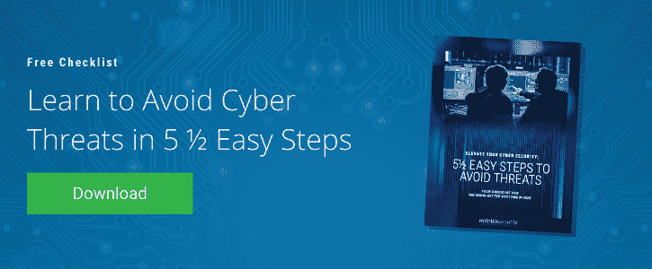

# 什么是多因素身份认证，它是如何工作的？

> 原文：<https://www.mitnicksecurity.com/blog/what-is-multi-factor-authentication-how-does-it-work>

似乎现在我们使用的所有东西都需要密码。从电子邮件和社交媒体账户到两者之间的任何东西，我们总是需要密码才能访问。

但是，这并不像想出一个密码并使用它做任何事情那么简单。至少，如果你不这样做是最好的...

对你所有的账户反复使用同一个密码是极其危险的。如果一个账户已经被攻破，而你在所有事情上都使用同一个密码，那么你所有的账户实际上都已经被攻破。

这就是为什么网络安全专业人士创造了一种叫做多因素认证(MFA)的东西——在这篇文章中，我们将告诉你这一切。

## 弱密码的现实

老实说——你曾经创建过不安全的密码吗？很有可能，你有，即使你没有意识到。你甚至可能会在许多账户中反复使用它，或者对它进行一些细微的修改。

毕竟，为数百个在线账户创建一个唯一的密码会让你很难记住所有的账户，因此人们会创建弱密码。

问题是...由于没有人想忘记自己的密码， [许多密码包含容易记住的片段](https://www.mitnicksecurity.com/blog/8-password-security-tips-from-kevin-mitnick-for-better-login-protection) ，如家庭成员的名字，宠物的名字和重要的日期。正确的密码保护的大忌！

**通过开源情报收集，名为** [**的攻击者**](https://www.mitnicksecurity.com/blog/how-social-engineers-use-your-digital-footprint-against-you) **的社交工程师可以在网上找到关于你的信息，创建一个面包屑痕迹来猜测你的密码。**这只是这年头密码容易被破解的原因之一。另一个原因是 [密码破解工具](https://www.mitnicksecurity.com/blog/5-common-hacking-techniques-for-2020) 的存在，它可以让攻击者在几分钟内尝试成百上千个密码。

[https://www.youtube.com/embed/K-96JmC2AkE](https://www.youtube.com/embed/K-96JmC2AkE)

你可能会问自己，“如果密码不安全，我们该如何保护我们的应用和账户安全？”输入多因素身份验证。

## 什么是多因素身份认证&它具体是如何工作的？

在 MFA 环境中， [光有密码不足以获得](https://www.mitnicksecurity.com/blog/5-ways-to-secure-your-workforce-when-working-from-hom) 的访问权限。可能仍然需要密码，但这只是拼图的一部分。除了密码，还需要其他因素来证明个人有权访问。

[**多因素认证**](https://www.onelogin.com/learn/what-is-mfa) **是一种用户必须提供两个或两个以上因素进行验证的认证方法。**

当针对获取访问权设置了多道防线时，真正的 MFA 要求用于获取访问权的因子不能是相同的*类型*的因子。

## 多因素身份认证的 5 种主要类型

### 1.知识(你知道的东西)

PRO **提示:** 因为你总是想使用两种独特的 MFA 因子，你不会想为你的两个因子使用密码和安全问题，因为它们都是知识因子。

### 2.拥有(你拥有的东西)

占有型指的是你身上的任何东西。

*   移动设备

*   钥匙扣

*   通行证

*   安全令牌

*   等等。

### 3.继承(你是什么)

基于继承的因子类型一般指生物特征识别。

*   指纹扫描

*   虹膜或视网膜扫描

*   声音识别

虽然知识、拥有和继承是三个最常用的多种纤维分析因素，但以下两个因素也值得一提:

### 4.行为(你做的事情)

计算机和其他设备可以检测出我们人类行为的模式。例如，计算机可以根据我们打字的模式来区分我们和另一个人。虽然这是非常罕见的，行为因素已被用于 MFA 环境。

### 5.位置(你所在的地方)

位置是有时用来帮助认证用户的另一个因素。例如，如果您应该从纽约登录一个帐户，但设备发现您从东京登录，它可能会阻止访问。

## MFA 的几个例子

1.  为了登录到她的公司计算机，Jane 必须首先将 USB 安全令牌插入到她的系统中(这是她拥有的东西)。插入令牌后，她必须在屏幕上输入自己的密码(她知道的密码)。系统检查以验证 Jane 实际上在公司办公室中(她在某个地方)。最后，简被允许使用她的电脑。
2.  马库斯正试图登录他的银行账户。输入他的用户名后，银行向他的手机(他有的东西)发送一条带有唯一一次性代码的短信。输入密码后，Marcus 在访问他的银行信息之前回答了几个安全问题(这是他知道的)。
3.  伊莎贝拉正进入一个安全设施。要进入该设施，她必须刷她的通行卡(她有的东西)。刷完卡后，她会扫描指纹(这是她的身份)，然后才能进入该设施。

## 为什么每个组织都需要 MFA

公司资产是有价值的，必须不惜一切代价加以保护。密码根本没用。

强密码卫生和 MFA 只是您的安全等式的一部分。

**免费下载我们的** [***避免网络威胁的 5 步指南电子书***](https://www.mitnicksecurity.com/lp-easy-steps-to-avoid-cyber-threats) 全面了解保护对您的组织意味着什么。

